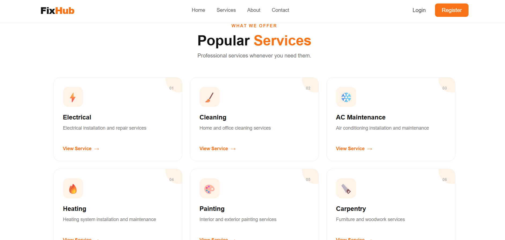
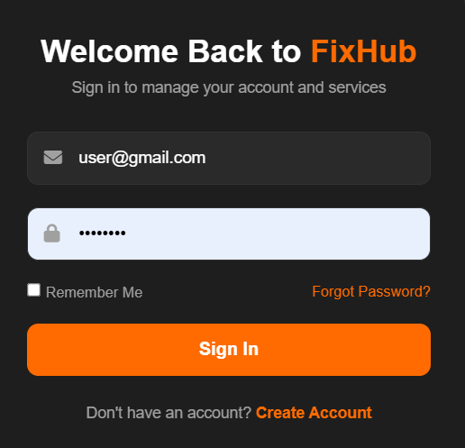
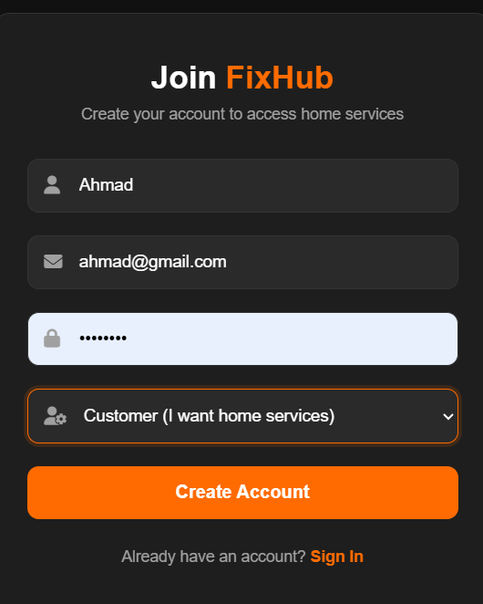
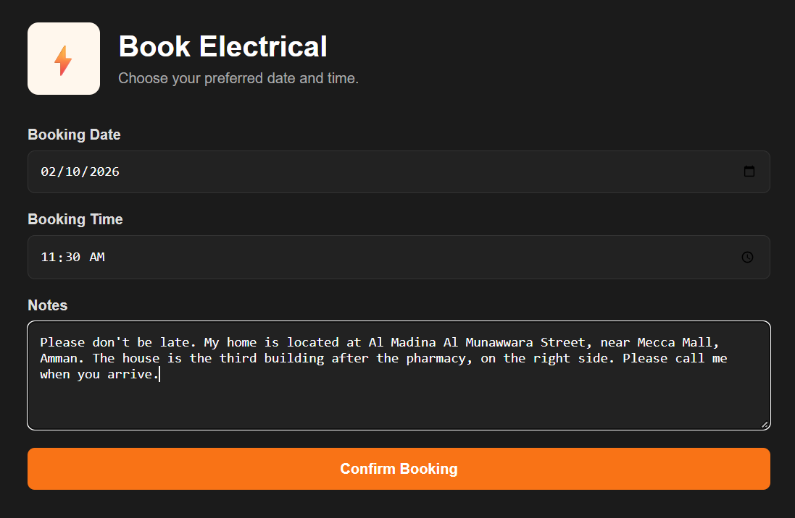
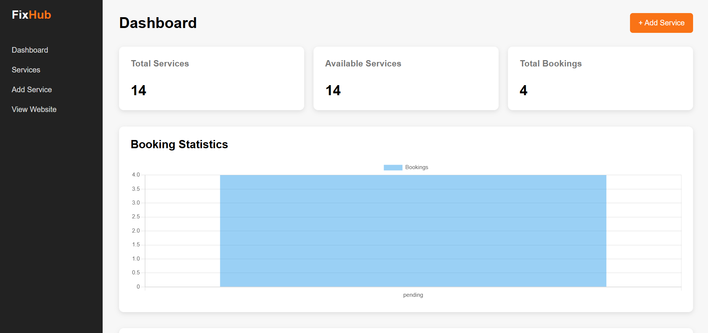
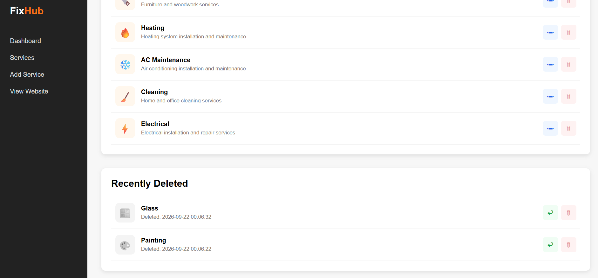
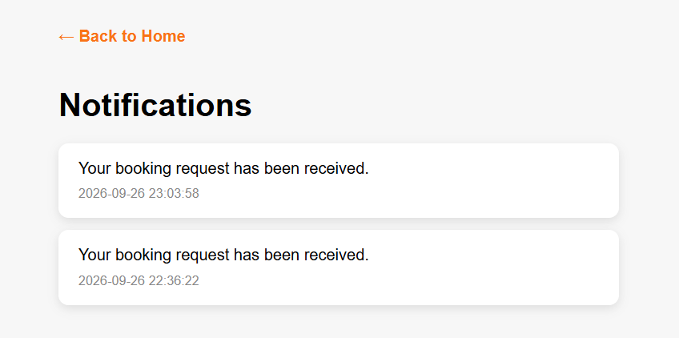

# FixHub

FixHub is a home services web application that helps users browse available home maintenance services and submit service requests such as plumbing, electrical work, cleaning, AC maintenance, painting, and more.

The project was built using **PHP, MySQL, HTML, CSS, and JavaScript**, with **Object-Oriented PHP** used to organize the application logic.

## Features

### User Features

* User Registration
* User Login and Logout
* Session-based Authentication
* Browse Available Services
* View Service Details
* Search Services (with live filtering)
* Filter Services by Category
* Submit Service Requests
* Create Bookings
* Receive Notifications for Booking Updates
* Real-time Toast Notifications

### Admin Features

* Admin Dashboard
* Add Services
* Edit Services
* Delete Services
* Restore Deleted Services
* Permanently Delete Services
* Manage Service Information

## Technologies

* PHP
* MySQL
* HTML5
* CSS3
* JavaScript
* Object-Oriented PHP
* PDO
* XAMPP
* Git & GitHub

## Project Structure

FixHub/
│
├── admin/
│   ├── add_service.php
│   ├── delete_service.php
│   ├── edit_service.php
│   ├── index.php
│   ├── permanent_delete.php
│   └── restore_service.php
│
├── assets/
│   ├── main.js
│   ├── style.css
│   └── images/
│       └── services/
│
├── classes/
│   ├── Auth.php
│   ├── Booking.php
│   ├── Notification.php
│   ├── Service.php
│   └── User.php
│
├── config/
│   └── Database.php
│
├── screenshots/
│   ├── admin-dashboard.png
│   ├── booking-successfully.png
│   ├── booking.png
│   ├── home-page.png
│   ├── login.png
│   ├── notifications.png
│   ├── register.png
│   ├── search-services.png
│   ├── services.png
│   ├── soft-delete.png
│   └── toast-messages.png
│
├── ajax_search.php
├── booking.php
├── get_new_notifications.php
├── index.php
├── login.php
├── logout.php
├── notifications.php
├── register.php
├── search_service.php
├── service_details.php
└── .gitignore

## OOP Structure

The project uses Object-Oriented PHP to organize the main application responsibilities.

* `User.php` — Handles user-related operations.
* `Auth.php` — Handles user authentication and sessions.
* `Service.php` — Handles service-related operations.
* `Booking.php` — Handles booking and service request operations.
* `Notification.php` — Handles creating and retrieving user notifications.
* `Database.php` — Handles the connection to the MySQL database.

## Admin Service Management

The admin section provides service management functionality, including:

* Adding new services
* Editing existing services
* Deleting services
* Viewing deleted services
* Restoring deleted services
* Permanently deleting services

The project uses **soft delete** functionality for services, allowing deleted services to be restored before permanent deletion.

## Search & Filtering

Users can search for services by keyword and filter results by category. The search updates automatically as the user types, without reloading the page.

## Notifications

Users receive a notification when they submit a booking. Notifications appear as a badge on the notification icon and as a toast message on the page. Users can view all notifications on a dedicated page.

## Database

The application uses **MySQL** as its database and **PDO** for database connectivity.

The database connection is handled through:

config/Database.php

## Screenshots

### Home Page

### Services

### Login

### Register

### Booking

### Booking Successfully

### Admin Dashboard

### Soft Delete

### Search Services

### Notifications

### Toast Messages

## How to Run the Project Locally

### 1. Clone the Repository

git clone https://github.com/ayaalsaudi6-blip/FixHub.git

### 2. Move the Project

Place the project inside your XAMPP `htdocs` folder:

C:\xampp\htdocs\FixHub

### 3. Start XAMPP

Start the following services from XAMPP:

* Apache
* MySQL

### 4. Create the Database

Open **phpMyAdmin** and create the required MySQL database.

Make sure the database name and connection settings match the configuration in:

config/Database.php

### 5. Run the Application

Open the following URL in your browser:

http://localhost/FixHub/

## Future Improvements

* Real-time Chat between Users and Service Providers
* Real Location Support using Maps and Coordinates
* Service Provider Ratings and Reviews
* Online Payment Integration
* Email Notifications
* Multi-language Support (Arabic / English)

## GitHub

[View FixHub Repository](https://github.com/ayaalsaudi6-blip/FixHub)

## Author

**Aya Alsaudi**

[GitHub](https://github.com/ayaalsaudi6-blip)

[LinkedIn](https://linkedin.com/in/aya-alsaudi-3a60b733b)